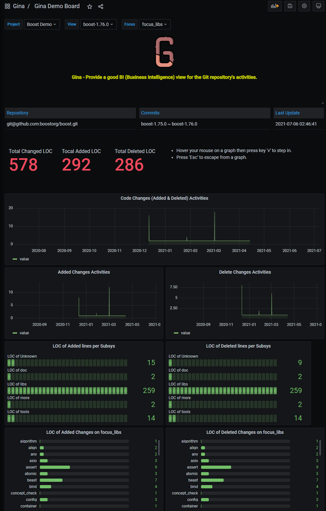
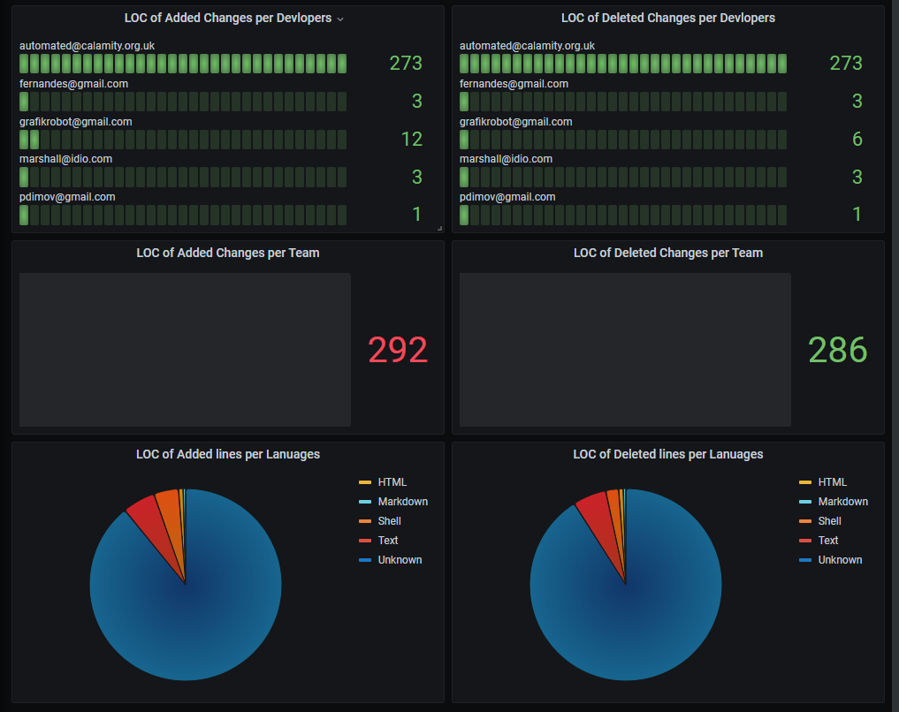
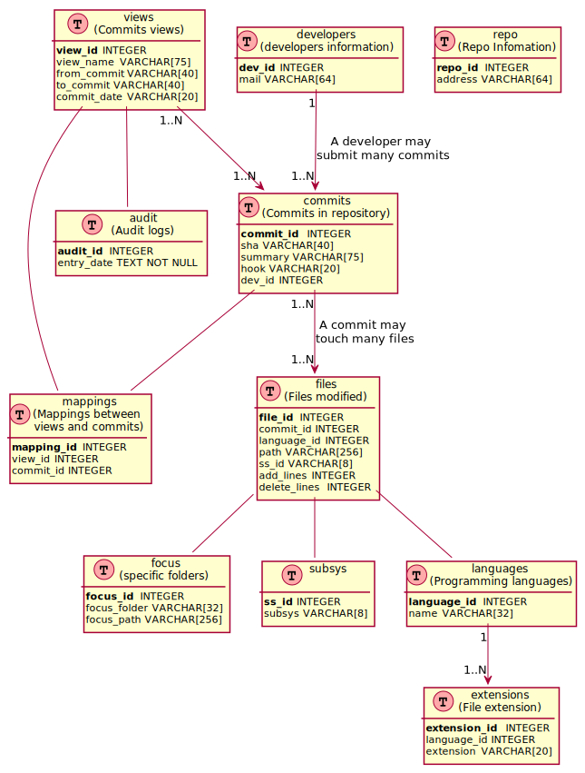

# Provide a good BI (Business Intelligence) view for a Git repository's activities.

<div align=center></div>

Gina is developed on the basis of Git and Grafana so it's named 'Gina[ˈdʒinə]' as mix between them. Gina provides a good analysis for a Git repository changes by showing charts. 
- Add/Delete lines on the subsys/developers/languages level.
- Configurable multiple repositories support
- Configurable views
- Configurable analysis for sepecial folders
- Focus on the modules with the large LOC
- Evaluate the potential bug numbers based on the LOC

## Prerequisites
Deployed on Centos 7.
Python2.7

### Install Grafana 7.5.6
```ShellSession
https://grafana.com/grafana/download
wget https://dl.grafana.com/oss/release/grafana-7.5.6-1.x86_64.rpm
sudo yum install grafana-7.5.6-1.x86_64.rpm
The configuration file is /etc/grafana/grafana.ini

systemctl enable grafana-server
systemctl start grafana-server
```
### Install Golang
```
wget https://dl.google.com/go/go1.12.5.linux-amd64.tar.gz
tar -C /usr/local -xzf go1.12.5.linux-amd64.tar.gz
vim /etc/profile
export GOROOT=/usr/local/go
export GOPATH=$HOME/go
export PATH=$PATH:$GOROOT/bin:$GOPATH/bin
source /etc/profile
```
### Install SQLite plugin
```
# https://github.com/fr-ser/grafana-sqlite-datasource
# This is a Grafana backend plugin to allow using a SQLite database as a data source.
wget https://github.com/fr-ser/grafana-sqlite-datasource/releases/download/v2.0.0/frser-sqlite-datasource-2.0.0.zip

systemctl restart grafana-server
```
### Make sure the Git credentials on this server is avaiable for cloning your repos by ssh.
### git version > 2.7
## Quick Start
### Add your repo's configurations
The configurations of your repos are organized in json format. One repo one json file. The necessary fields descriptions are:
- `repo_address`: Git repository address with the format - url:port/repo.
- `repo_local_name`: Git repository folder name after cloned.
- `repo_home`: Gina work directory where the local repos, the database files and the logs stored at.
- `db`: The output database file prepared for Grafana as the data source.
- `dev`: The developers information including email address and the team name or manager email.
  - Use `python src/init_dev_info.py -c my_cnfg.json -d 10` to generate the devs information.
  - Examples:
    ```
    [
        {
            "mail": "torvalds@evo.osdl.org",
            "team": "Core Team"
        },
        {
            "mail": "joakimlonnegren@gmail.com",
            "team": "Other Team"
        }
    ]
    ```
  - The team name will be "unavailable" for the seperating people who left the company.
- `subsys`: A list of the sub systems in your repo. In General, they're the folders under the root of your repo. If you'd like to get the list of all folders under current path, try `find . -type d -maxdepth 1 | gawk -F'./' '{printf "\"%s\", ", $2}'`.
- `focus`: A path in your repo that you want to focus on. Gina will list all folders under it and analyze them in a seperated panel on the dashborad.
- `views`: The list of the scope in your repo. A view is a chain of commits. The `view_name`, `from_commit` and `to_commit` are necessary. If the view is working on a developing branch, `to_commit` can be set as `HEAD` but MUST specified `branch` accordingly.

Example:
```ShellSession
{
    "repo_address": "git@github.com:torvalds/linux.git",
    "repo_local_name": "boostorg_boost",
    "home": "/var/gina",
    "db": "/var/gina/git_boostorg_boost.db",
    "dev": "/var/gina/devs_boostorg_boost.json",
    "subsys": ["arch", "scripts", "block", "fs", ".git", "sound", "certs", "tools", "virt", "include", "Documentation", "ipc", "security", "samples", "kernel", "lib", "drivers", "mm", "usr", "net", "init", "LICENSES", "crypto"],
     "focus": [
        {
            "name": "net",
            "path": "net"
        }
     ]
    "views": [
        {
            "view_name": "boost-1.76.0",
            "from_commit": "boost-1.75.0",
            "to_commit": "boost-1.76.0"
        },
        {
            "view_name": "boost-1.75.0",
            "from_commit": "boost-1.74.0",
            "to_commit": "boost-1.75.0"
        }
    ]
}
```

### Initialize developer information
Example:
```
python ./src/init_dev_info.py -c ./cnfg/git_boostorg_boost.json
```

### Generate database
Parse the data from the Git repository by using `git` command.
```
python ./src/git_setup_db.py -c ./cnfg/git_boostorg_boost.json
```
### Import dashbord 
* Open http://localhost:3000/ on your browser.
* The default login/passwd is admin/admin.
* Add data source and select SQLite.
* Import GinaBoard.json to create a new dashboard on Grafana.

### Cron job
Modify `run.sh` and `cron.sh` as you wish to set a periodically job for the db update.

# Enjoy
On the dashboard, hover your mouse on a graph then press key `v` to step in it. Press `Esc` to escape from a graph.
The dashboard exmaple:



## Database Desgin
Gina is currently using SQLite3 as the database.
> SQLite is a C-language library that implements a small, fast, self-contained, high-reliability, full-featured, SQL database engine. SQLite is the most used database engine in the world. SQLite is built into all mobile phones and most computers and comes bundled inside countless other applications that people use every day. [More Information..](https://www.sqlite.org/index.html).



## TODO
* More database supports.
* More database supports.
* Find the developers in Git repo history who are missing in the `dev_json` or `sep_dev_json`.
* Generate deverlopers information template from Git repo history.

## References
* [Grafana Docs](https://grafana.com/docs/grafana/next/datasources/mysql/)
* [grafana-sqlite-datasource](https://github.com/fr-ser/grafana-sqlite-datasource)
